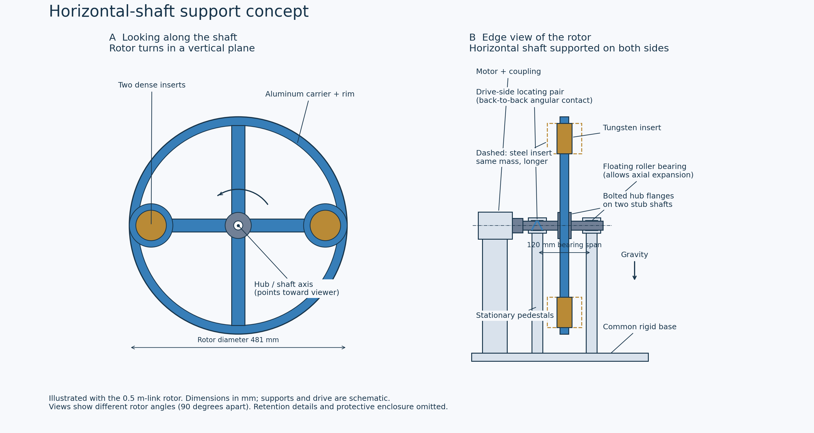

# Same-mass tungsten insert comparison

The principal advantage is reduced insert protrusion. Carrier stresses are essentially unchanged (fine-mesh differences about 0.03%, below mesh sensitivity), combined horizontal displacement decreases about 0.4-0.5%, and insert stress decreases about 23%. Low bending frequencies rise modestly while the dominant torsional mode stays nearly constant. The carrier and insert bounds remain below their provisional factor-of-two yield screening limits. These are idealized rotor results, not a validated support/retention assembly.

## Scope and material

The 0.5, 1 and smallest qualified 2 m rotor carriers, insert radii/centers, bare masses, spin speeds and modulation timing are unchanged. Each insert is shortened to 43.61% of its steel length. CAD mass and polar inertia are preserved; conformal meshes are regenerated. This comparison repeats all 26 static/prestressed-modal cases of the steel baseline, with fixed bore and perfectly bonded inserts. It is not an assembly contact model or a new BER qualification.

Use illustrative 95% tungsten heavy alloy K1800/ET95: density 18000 kg/m3, E=330 GPa from [Elmet manufacturer data](https://www.elmettechnologies.com/wp-content/uploads/2025/09/Tungsten-Heavy-Alloy-Product-Datasheet.pdf). Poisson ratio 0.28 is an explicit modeling assumption. The table lists yield >=517 MPa; a conservative 500 MPa study specification requires procurement certification. Aluminum remains 6061-T651 with a 240 MPa screening value. Static yield screening uses a factor of two.

## Matched fine-mesh comparison

| Link (m) | Aluminum combined bound, steel / W (MPa) | Combined displacement, steel / W (um) | Tungsten combined bound (MPa), all attitudes |
|---:|---:|---:|---:|
| 0.5 | 9.72 / 9.72 | 15.26 / 15.19 | 3.80 |
| 1 | 28.98 / 28.99 | 77.77 / 77.39 | 11.58 |
| 2 | 55.50 / 55.52 | 314.95 / 313.67 | 21.85 |

Combined aluminum/displacement columns assume a horizontal shaft (gravity in the rotor plane). They add conservative norms of centrifugal, maximum angular-acceleration and gravity solutions; simultaneous maxima are not implied. Insert stress column additionally bounds axial gravity. All-attitude and phase-sampled results are retained in comparison.json.

## Prestressed modes at center speed

| Link (m) | Steel first three (Hz) | Tungsten first three (Hz) | W dominant angular-coupled mode / effective inertia (%) |
|---:|:---|:---|:---|
| 0.5 | 77.33, 94.69, 105.27 | 77.98, 95.50, 105.27 | 3 / 99.76 |
| 1 | 45.39, 55.04, 60.18 | 45.78, 55.52, 60.18 | 3 / 99.76 |
| 2 | 25.76, 30.88, 33.09 | 25.99, 31.16, 33.09 | 3 / 99.76 |

The frequency ordering is a comparison, not proof of matching shapes across different meshes/materials. Component energies, insert motions and angular coupling are saved in modal_response_h*.json. Within each tungsten mesh, center/low/high modes are matched by consistent-mass MAC. Isolated-transition damping sweeps are diagnostic; they omit repeated-message resonance, shaft/bearing compliance, gyroscopic terms and motor dynamics.

## Mesh and load checks

| Link (m) | W centrifugal Al peak, coarse / fine (MPa) | W displacement change (%) | W regional combined stress change (%) |
|---:|---:|---:|---:|
| 0.5 | 7.58 / 8.91 | 0.092 | 0.203 |
| 1 | 23.21 / 27.30 | 0.092 | 0.223 |
| 2 | 43.77 / 51.48 | 0.092 | 0.215 |

Positive element Jacobians, exact consistent-load torque, force/moment equilibrium, cross-design static scaling and independent modal mass normalization are checked. Fine/coarse raw stress peaks can remain sensitive to local discretization; regional averages do not replace local strength assessment. The steel reference third mesh is not evidence of convergence for tungsten.

Additional 10 mm reference mesh, scaled to the 0.5 m rotor at its upper operating speed: aluminum centrifugal peak 8.9622 MPa, change 0.597% from the 13 mm mesh. Displacement 9.9532 um. This checks tungsten centrifugal convergence only; combined-load and contact convergence are not established by it.

## Signal and windage implications

| Link (m) | Steel second harmonic (m/s2) | W second harmonic (m/s2) | Change (%) |
|---:|---:|---:|---:|
| 0.5 | 4.208961e-10 | 4.245859e-10 | 0.877 |
| 1 | 4.208961e-10 | 4.235168e-10 | 0.623 |
| 2 | 5.180259e-10 | 5.205907e-10 | 0.495 |

Signal uses the established steel field quadrature with only insert axial coordinates compressed, keeping every mass weight and carrier point unchanged. This isolates the finite-height effect at the same equatorial receiver position; Fourier phase refinement is checked. Leading quadrupole and polar inertia stay constant, but finite-range signal rises slightly as mass moves closer to the receiver plane. No packet simulations are repeated.

Exposed insert height and projected side area outside the carrier fall 75.4%. This is a geometric windage proxy, not a CFD prediction or a 75.4% whole-rotor power saving. Rotor rim, spokes, surface friction, flow interactions and the enclosure also matter. Acceleration torque and radial centrifugal forces do not fall at fixed mass/radius/speed. Real insert retention and material-specific fabrication remain to be modeled.

## Horizontal support drawing

The rotor plane is vertical, like a wheel. Two stationary pedestals support horizontal stub shafts on opposite faces of its hub; the motor is outside the drive-side support. Bearings and pedestals lie outside the axial swept envelope. One bearing arrangement locates the rotor axially, while the opposite permits expansion. The front and edge views show rotor angles 90 degrees apart. The 0.5 m rotor dimensions illustrate the concept; supports/drive are schematic and insert retention/enclosure are omitted. SVG and PDF versions are included.

## Reproduction

Run tungsten_link_fea.py --prepare --workers 4; compile_tungsten_link_fea.py --mesh .018 and --mesh .013; tungsten_modal_response.py for both meshes; tungsten_field_comparison.py; draw_horizontal_support.py; refine_tungsten_reference.py; report_tungsten_comparison.py. Inputs, solver outputs, material metadata and hashes are retained in this folder.
